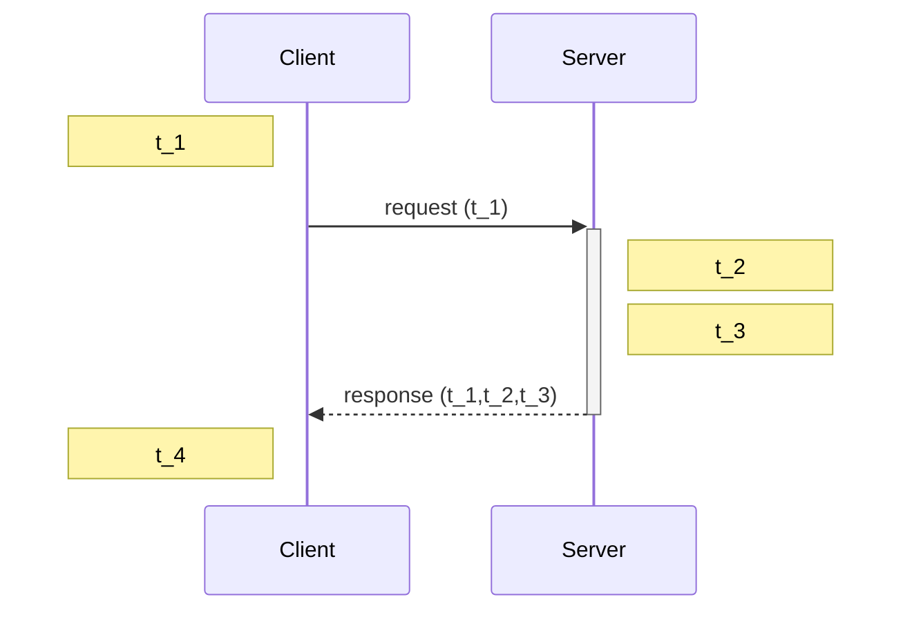

Distributed systems need to rely on time for:
- Scheduling
- Timeouts/failure detection
- Performance measurement and profiling
- Ordering log files and databases
- Caching (with a certain time-to-live)
# Physical clocks
A computer's clock is based on quartz oscillators, which can run a little fast or slow due to small defects or environmental variables like temperature. This is called **clock drift**, and is measured in parts per million (ppm), with 1 ppm meaning a maximum deviation of 1 tick per million ticks. 
# Atomic time
Atomic clocks have much higher accuracy, and take around 3 million years to drift 1 second, though they are much more expensive. Per atomic time, 1 year = 365 x 24 x 60 x 60 x 9192631770 periods of caesium-133's resonant frequency.
# Coordinated universal time (UTC)
**Coordinated universal time (UTC)** is the international standard for time which is used as a reference to calculate local time in a timezone. A year based on the earth's rotation doesn't line up exactly with atomic time, so UTC is coordinated with atomic time by occasionally adding leap seconds.
# Timestamps
## Unix time
**Unix time** is the number of seconds since 1st January 1970 (known as the **epoch**)
## ISO 8601
**ISO 8601** is the international standard for timestamps, and is represented as YYYY-MM-DD HH-MM-SS-Microseconds+timezone offset relative to UTC

Both representations ignore leap seconds, so software needs to take care of it
# Clock synchronisation
**Clock skew** is the difference between two clocks at a point in time, and due to clock drift in quartz clocks the skew between the computers will increase over time. This is fixed using clock synchronisation. There are two approaches:
- **External synchronisation** ensures that each process $C(i)$'s clock is within a bound $D$ of a well-known clock $S$ external to the group, so $|C(i)-S|<D$. $S$ may be connected to UTC or an atomic clock
	- Examples are Cristian's algorithm and NTP
- **Internal synchronisation** ensures that every pair of processes in a group have clocks within bound $D$, so $|C(i)-C(j)|<D$ for all processes $i,j$
	- Example is the Berkeley algorithm
## Network time protocol
**Network time protocol (NTP)** is a commonly used clock synchronisation strategy, with a hierarchy of clock servers arranged in strata:
- Stratum 0: atomic clocks
- Stratum 1: primary time servers which sync with stratum 0, and may sync with each other
- Stratum $n$: syncs with stratum $n-1$ and may sync with each other

We can then calculate the RTT as $RTT =(t_2-t_1)+(t_4-t_3)$, and estimate the response time to be $t_3+\frac{RTT}{2}$, and calculate our clock skew as $Skew=t_3+\frac{RTT}{2}-t_4$. This can be iterated to ensure that the clock stays in sync with the server.
Even with this, we still have a non-zero error, as there is some variance in RTTs, and the clocks will drift a little between each synchronisation.
# Ordering of events
Clock synchronisation is one way to order events, but it is not the only one. In order to order, we need to determine causality, i.e. if event $A$ happens causally before event $B$, then $\text{timestamp}(A)<\text{timestamp}(B)$.
We can establish a **happens-before relation** if we define an **event** as something happening at one node:
- executing an instruction
- sending a message
- receiving a message

We can then say that event $A$ happens before event $B$ (writen $A\rightarrow B$) iff:
- $A$ and $B$ happen on the same node, and $A$ occurred before $B$ in that node's local execution order
- $A$ is the sending of a message $M$, and event $B$ is the receiving of message $M$
- There exists an event $C$ such that $A\rightarrow C$ and $C\rightarrow B$

Happens-before is a partial order, so $A\rightarrow B\ \&\&\ B\rightarrow A$ is not possible. In this case they are concurrent, written $A||B$.
# Logical clocks
A clock doesn't need to measure time, it just needs to provide a timestamp such that $A\rightarrow B\implies\text{timestamp}(A)<\text{timestamp}(B)$
## Lamport clocks
A **Lamport clock** assigns a logical timestamp to each event. It works as follows:
- Each process maintains a counter value, and on init each counter value is 0
- Each process increments its counter when a sent or execution event occurs
- A sent message carries the counter
- When a message is received, the recipient updates its local counter to $\max(\text{local counter},\text{message counter})+1$

This means that if $A\rightarrow B$ then $\text{value-of-counter(A)}<\text{value-of-counter(B)}$, but $\text{value-of-counter(A)}<\text{value-of-counter(B)}$ does not imply $A\rightarrow B$, and it is possible to do $\text{value-of-counter(A)}-\text{value-of-counter(B)}$ for all $A\neq B$.
A pair of concurrent events don't have causal paths from one event to the other, so a Lamport clock is not guaranteed to be ordered or unequal for concurrent events. $\text{value-of-counter(A)}<\text{value-of-counter(B)}$ can mean either $A\rightarrow B$ or $A||B$
## Vector clocks
A **vector clock** keeps track of the time of every node in the system in a vector $N=[N_1,N_2,...,N_n]$. The vector timestamp of an event $a$ is $V(a)=[t_1,t_2,...,t_n]$, with $t_i$ being the number of events observed on node $N_i$. A vector clock works as follows:
- On initialisation at node $N_i$ set clock $T=[0,0,...,0]$.
- On any event occurring at node $N_i$, set $T[i]=T[i]+1$
- On a send event at $N_i$ increment $T_i$ and send $(T,M)$
- On receiving a message at node $N_j$, increment $T[j]$ and for every $k\neq j,k\in{1,...,n}$, do $T[k]=\max(T[k],T'[k])$

We say:
- $VT_a=VT_b$ iff $VT_a[i]=VT_b[i]$ for all $i=1,...,N$
- $VT_a\leq VT_b$ iff $VT_a[i]\leq VT_b[i]$ for all $i=1,...,N$

Two events are causally related iff $VT_a<VT_b$ i.e. $VT_a\leq VT_b$ and there exists a $j$ such that $1\leq j\leq N$ and $VT_a[j]<VT_b[j]$.
Two events are concurrent iff $VT_a\nleq VT_b$ and $VT_b\nleq VT_a$
# Global snapshots
A **global snapshot** captures the global state of the system, specifically the individual state of each process in the system and of each communication channel in the system.

A global snapshot needs to be a **consistent cut**. A cut $C={c_1,c_2,...,c_n}$ is consistent if for all nodes there are not events $e_i,e_j$ such that $(e_i\rightarrow e_j)\land(e_j\rightarrow c_j)\land(e_i\nrightarrow c_i)$. Simply put, a cut is consistent for each pair of events $e,f$ in the system, if event $e$ is in $C$, and if $f\rightarrow e$, then $f$ is also in $C$. A **global state** $S$ is consistent if it corresponds to a consistent cut.
## Chandy-Lamport snapshot algorithm
The **Chandy-Lamport snapshot algorithm** can take a snapshot of a system modelled as:
- A collection of processes each with a local state
- A collection of communication channels, either empty or with messages in-flight, between each pair of processes
- Communication channels are unidirectional and FIFO-ordered
- No failure, with all messages arriving intact and exactly once
- Snapshot does not interfere with normal execution
- Each process can record its own state and the state of incoming channels
- Only one process initiates a snapshot

It works as follows:
Whenever a process $P_i$ receives a marker message on an incoming channel $C_{ki}$
- If it is the first marker $P_i$ is seeing:
	- It records its own state
	- It marks the state of the channel $C_{ki}$ as empty
	- For each $j=1\text{ to }N$ except $i$, $P_i$ sends a marker message on channel $C_{ij}$
	- Start recording all incoming messages on each incoming channel $C_{ij}$ for each $j=1\text{ to }N$ except $i,j$
- If it has seen a marker before:
	- Mark the state of channel $C_{ki}$ as all the messages that have arrived on it
	- Mark channel $C_{ki}$ as empty
### Example
See [here](https://decomposition.al/blog/2019/04/26/an-example-run-of-the-chandy-lamport-snapshot-algorithm/)
### Proof
Let $e_i$ and $e_j$ be events occurring at $P_i$ and $P_j$ such that $e_i\rightarrow e_j$. The snapshot algorithm ensures that if $e_j$ is in the cut then $e_i$ is also in the cut. This implies that if $e_j\rightarrow P_j\text{ records its state}$ then $e_i\rightarrow P_i\text{ records its state}$.
We can prove it by contradiction:
- Suppose $e_j\rightarrow P_j\text{ records its state}$ and $P_i\text{ records its state}\rightarrow e_i$
- Path of messages goes from $e_i\rightarrow e_j$
- Due to FIFO ordering, the markers on each link in the above path will precede regular messages
- Thus, since $P_i\text{ records its state}\rightarrow e_i$ then it must be true that $P_j$ received a marker before $e_j$
- Which implies that $e_j$ is not in the cut - a contradiction
# Global state
A system moves from one global state to another via causal steps.

**Liveness** for a property $P_r$ in a given state $S$ means that $S$ satisfies $P_r$, or there is some causal path of global states from $S$ to $S'$ where $S'$ satisfies $P_r$. e.g. in the long run, computation will complete.
**Safeness** for a property $P_r$ in a given state $S$ means that $S$ satisfies $P_r$ and all global states $S'$ reachable from $S$ also satisfy $P_r$. e.g. there is no series of events that result in a deadlock.

It is difficult to guarantee both in an asynchronous system.

The Chandy-Lamport algorithm can be used to detect global properties that are stable (i.e. once it's true, it will always be true).
- Stable liveness - computation has terminated
- Stable non-safety - there is a deadlock, as an object is not referenced anymore
